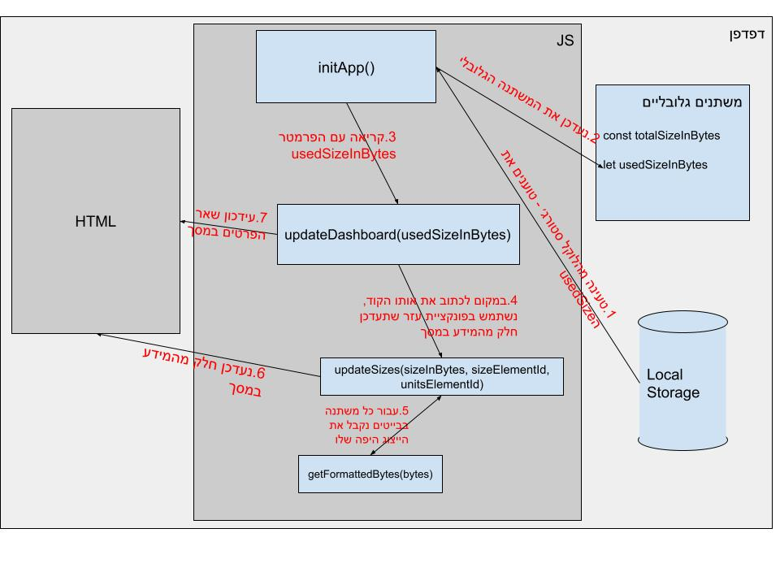
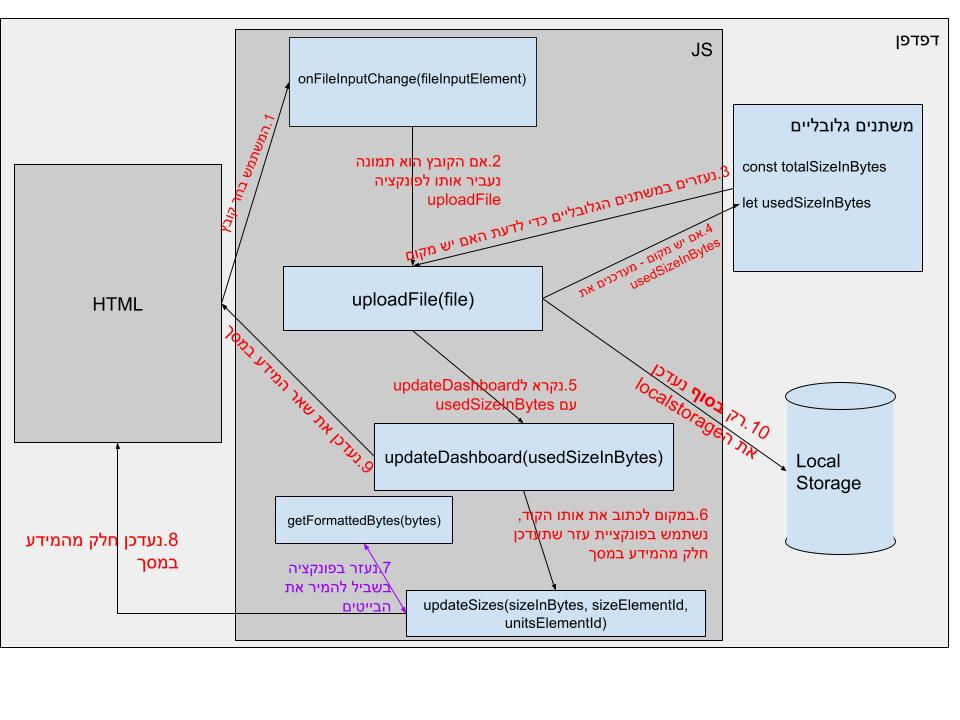

# Fylo שדרוג קוד

 בחרתי לעבוד עם בייטים (במקום מגה בייט).
למה?
תסתכלו על הקוד שכתבנו בכיתה.. מה יקרה אם נחליט לשנות ל2000 מגה? בעיה.
הקוד לא מספיק גמיש.
שימו לב: ההמרה לפורמט ״יפה״ (מגה,גיג׳ה וכו׳) תיקרה רק לפני הכתיבה למסך (לפני כן נוח לנו לעבוד עם בייטים כי גם file.size מיוצג בבייטים)

<h2 dir="rtl">
הסבר על כל פונקציה:
</h2>

<h3 dir="rtl" style="text-decoration: underline;">
<ins>
initApp - אחראית על איתחול האפליקציה
</ins>
</h3>
<ul>
<li>
פונקציה שלא מקבלת פרמטרים
</li>
<li>
 קוראת מהלוקל סטורג׳
</li>
<li>
 קוראת לupdateDashboard עם הפרמטר usedSizeInBytes
</li>
</ul>
<h3 dir="rtl" style="text-decoration: underline;">
<ins>
updateDashboard - מקבלת את מספר הבייטים בשימוש ואחראית על עידכון המסך
</ins>
</h3>
<ul>
<li>
 תקרא ל updateSizes כדי לעדכן את המספרים במסך
</li>
<li>
 תעדכן את שאר הדברים (כמו הפרוגרס בר)
</li>
</ul>
<h3 dir="rtl">
<ins>
updateSizes - פונקציה שתעדכן את המספרים והיחידות מידה במסך
</ins>
</h3>
<ul>
<li>
 מקבלת גודל בבייטים ואת האלמנטים שצריך לעדכן
</li>
<li>
 סתם כתבתי אותה כי ראיתי שיש הרבה קוד שחוזר על עצמו, אז העדפתי לקרוא לה כמה פעמים עם הפרמטרים הרלוונטיים
</li>
<li>
 תעזר ב getFormattedBytes בשביל לקבל ייצוג יפה של הגודל
</li>
</ul>
<h3 dir="rtl">
<ins>
getFormattedBytes - מקבלת מספר בייטים ומחזירה אותם בצורה יפה יותר (מגה בייט, גיג׳ה בייט וכו׳)
</ins>
</h3>
<ul>
<li>
• סתם מצאתי אותה באינטרנט :)
</li>
<li>
• מחזירה אובייקט עם שני מפתחות: גודל ויחידת מידה (למשל, גודל: 25, יחידת מידה: מגה)
</li>
</ul>
<h3 dir="rtl">
<ins>
onFileInputChange - אחראית לבדוק אם הקובץ הוא תמונה
</ins>
</h3>
<ul>
<li>
 תרוץ כשהמשתמש יבחר קובץ
</li>
<li>
 אם הקובץ תמונה, תעביר אותו ל updateFile
</li>
</ul>
<h3 dir="rtl">
<ins>
updateFile - מקבלת קובץ ואחראית על לעדכן משתנים (ולוקל סטורג׳)
</ins>
</h3>
<ul>
<li>
 כשיהיה לנו שרת, יכול להיות שהפונקציה הזו תדאג להעלאת הקובץ
</li>
<li>
 היחידה שמעדכנת את הלוקל סטורג׳
</li>
</ul>

 
 

<h3>
מצרף פה ציור שעוזר לעקוב אחרי הקוד
</h3>
<h4>
(בתכלס הציור לא מדויק, אבל זה עוזר להבין פחות או יותר את התמונה מלמעלה)
</h4>

<h3 dir="rtl">
הflow הרגיל:
</h3>

<h3 dir="rtl">flow כשמעלים קובץ</h3>

 
<h3>
תרגישו חופשי להשתמש בקוד או אולי אפילו לשפר אותו :)
</h3>

